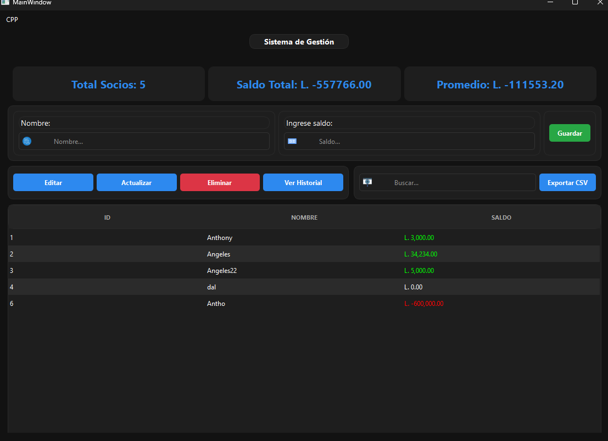

# Sistema de Gestión en C++ con Qt / C++ Qt Management System

## 🇪🇸 Español

### Descripción
Este es un sistema de gestión de socios desarrollado en **C++ utilizando el framework Qt**, diseñado para facilitar el manejo de registros de miembros mediante operaciones CRUD (Crear, Leer, Actualizar, Eliminar). El sistema incluye funcionalidades avanzadas como búsqueda en tiempo real, exportación de datos a CSV, un panel de control con estadísticas y un sistema de registro de acciones (logs) para auditoría.

### Características principales
- Registro de socios con campos: ID, nombre y saldo
- Edición y eliminación de registros existentes
- Búsqueda instantánea en la base de datos de socios
- Exportación de registros a archivos CSV (compatible con Excel)
- Panel de control (Dashboard) con métricas clave:
  - Total de socios registrados
  - Suma total de saldos
  - Promedio de saldos por socio
- Sistema de logs para auditoría de cambios y acciones
- Interfaz gráfica moderna desarrollada con Qt Widgets
- Tema oscuro profesional para reducir la fatiga visual

### Requisitos previos
- Framework Qt 6 o superior
- CMake 3.16 o superior
- Compilador de C++ compatible (MinGW, MSVC, Clang o GCC)
- STL (Standard Template Library)

### Compilación e instalación
1. Clona el repositorio:
   ```bash
   git clone https://github.com/yourusername/SistemaGestionCPP.git
   cd SistemaGestionCPP
   ```
2. Crea un directorio de compilación:
   ```bash
   mkdir build && cd build
   ```
3. Configura el proyecto con CMake:
   ```bash
   cmake ..
   ```
4. Compila el proyecto:
   ```bash
   cmake --build .
   ```

### Uso
Una vez compilado, ejecuta el archivo binario generado en el directorio `build` (por ejemplo, `SistemaGestionCPP.exe` en Windows). La interfaz gráfica se abrirá, permitiéndote gestionar los socios, ver estadísticas y exportar datos.

### Tecnologías utilizadas
- **C++**: Lenguaje de programación principal
- **Qt Framework**: Desarrollo de la interfaz gráfica y componentes de la aplicación
- **CMake**: Sistema de construcción multiplataforma
- **STL**: Uso de vectores, cadenas y manejo de archivos

### Estructura del proyecto
```
SistemaGestionCPP/
├── src/          # Código fuente de la aplicación
├── include/      # Archivos de cabecera
├── images/       # Imágenes de la interfaz
├── icons/        # Iconos del sistema
├── CMakeLists.txt # Configuración de CMake
└── README.md     # Este archivo
```

---

## 🇺🇸 English

### Description
This is a member management system developed in **C++ using the Qt framework**, designed to streamline member record handling through CRUD (Create, Read, Update, Delete) operations. The system includes advanced features such as real-time search, CSV data export, a statistics dashboard, and an action logging system for audit purposes.

### Main Features
- Member registration with fields: ID, name, and balance
- Edit and delete existing records
- Instant search across the member database
- Export records to CSV files (Excel compatible)
- Dashboard with key metrics:
  - Total registered members
  - Total balance sum
  - Average balance per member
- Action logging system for change and audit tracking
- Modern graphical interface built with Qt Widgets
- Professional dark theme to reduce eye strain

### Prerequisites
- Qt 6 framework or higher
- CMake 3.16 or higher
- Compatible C++ compiler (MinGW, MSVC, Clang, or GCC)
- STL (Standard Template Library)

### Build and Installation
1. Clone the repository:
   ```bash
   git clone https://github.com/yourusername/SistemaGestionCPP.git
   cd SistemaGestionCPP
   ```
2. Create a build directory:
   ```bash
   mkdir build && cd build
   ```
3. Configure the project with CMake:
   ```bash
   cmake ..
   ```
4. Compile the project:
   ```bash
   cmake --build .
   ```

### Usage
Once compiled, run the generated binary in the `build` directory (e.g., `SistemaGestionCPP.exe` on Windows). The graphical interface will open, allowing you to manage members, view statistics, and export data.

### Technologies Used
- **C++**: Primary programming language
- **Qt Framework**: GUI development and application components
- **CMake**: Cross-platform build system
- **STL**: Use of vectors, strings, and file handling

### Project Structure
```
SistemaGestionCPP/
├── src/          # Application source code
├── include/      # Header files
├── images/       # Interface images
├── icons/        # System icons
├── CMakeLists.txt # CMake configuration
└── README.md     # This file
```

---

## Screenshots / Capturas de pantalla

### Main Window / Ventana principal


### Icons / Iconos


